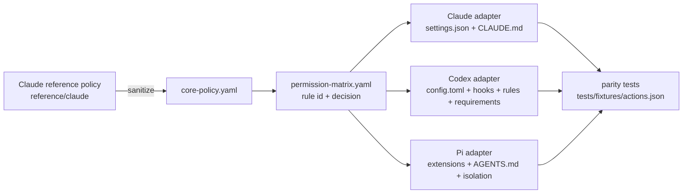

# agents-adapter

policy กลางแบบ provider-neutral ที่ทำให้ Claude Code, Codex CLI และ Pi CLI ตัดสิน permission เหมือนกันในเชิงพฤติกรรม: action เดียวกันได้ผล `ALLOW` / `ASK` / `DENY` เดียวกันทุก CLI

## agents-adapter คืออะไร

Agent CLI แต่ละตัวมี permission model คนละแบบ: Claude มี `permissions.allow/ask/deny` + sandbox + autoMode, Codex มี permission profile + hooks + rules + requirements, ส่วน Pi ไม่มี permission layer เลย agents-adapter ไม่พยายามทำให้ key หรือ format เหมือนกัน แต่แปลง policy กลางหนึ่งชุดเป็น configuration native ของแต่ละ CLI แล้วพิสูจน์ด้วย parity test ว่าทั้งสามตอบเหมือนกัน



## เหตุผลที่ semantic parity สำคัญ

เมื่อ user สลับ CLI ระหว่างงาน กฎที่ต่างกันเพียงเล็กน้อย (เช่น CLI หนึ่งยอม `git push --force-with-lease` อีกตัวไม่ยอม) ทำให้ agent หลุดขอบเขตโดยไม่มีใครรู้ parity ที่ตรวจด้วย fixture เดียวกันทำให้ hard boundary เป็นสัญญาที่พิสูจน์ได้ ไม่ใช่ความหวัง

## Claude เป็น reference อย่างไร

- `reference/claude/CLAUDE.sanitized.md` และ `settings.sanitized.json` คือ behavioral authority (sanitize แล้ว)
- `policy/core-policy.yaml` สกัดกฎที่ provider-neutral; `policy/permission-matrix.yaml` คือ contract ที่เครื่องอ่านได้; `policy/provenance.yaml` ชี้ว่าแต่ละ rule มาจากตรงไหนของ Claude reference
- การเปลี่ยน policy เริ่มจาก Claude reference -> matrix -> adapters -> fixtures -> parity

## ALLOW / ASK / DENY

| decision | ความหมาย |
|---|---|
| `ALLOW` | ทำได้โดยไม่ถามซ้ำภายใน Development Trust Zone |
| `ASK` | ขออนุมัติหนึ่งครั้งต่อ action + target + environment แล้วใช้ approval เดิมกับขั้นตอนต่อเนื่อง |
| `DENY` | hard block ข้ามไม่ได้ด้วย prompt, subagent, plugin, project config, CLI flag, auto-review หรือ shell wrapper |

รายการ rule ทั้งหมดอยู่ใน `policy/permission-matrix.yaml` และตาราง parity อยู่ใน `docs/parity-matrix.md`

## adapter แต่ละตัวทำงานอย่างไร

| CLI | enforcement | รายละเอียด |
|---|---|---|
| Claude Code | native | `permissions.deny/ask/allow`, `sandbox` (filesystem, network, credentials), `autoMode`, `disableBypassPermissionsMode`; merge แบบ managed keys ไม่ overwrite ทั้งไฟล์ ดู `docs/claude-adapter.md` |
| Codex CLI | native + hook | ลบ `sandbox_mode = "danger-full-access"`, permission profile ไม่มี `"/" = "read"`, `requirements.toml` ปิด `:danger-full-access`, PreToolUse hook (`policy_gate.py`) บังคับ DENY, `rules/default.rules` ทำ ASK, GitHub connector tools ถูกตรวจแบบ dynamic ดู `docs/codex-adapter.md` |
| Pi CLI | extension + isolation | extension 4 ตัว intercept `tool_call`, `user_bash` (`!` และ `!!`), `input` (`/share`); ASK ใช้ `ctx.ui.confirm()` พร้อม cache ต่อ session; profile `host-macos` และ `docker/gondolin/openshell` ดู `docs/pi-adapter.md` |

## วิธีติดตั้ง

ต้องมี Node.js 24 ขึ้นไป และ python3 (สำหรับ Codex hooks)

```bash
git clone https://github.com/{{github_owner}}/agents-adapter.git
cd agents-adapter
scripts/install.sh            # npm ci -> init config -> plan -> ถามยืนยัน -> apply -> doctor
```

config ของเครื่องอยู่ที่ `${HOME}/.config/agents-adapter/config.yaml` (สร้างจาก `config/config.example.yaml`; ห้าม commit)

## วิธี dry-run

```bash
node src/cli.ts plan --target all      # ไฟล์ที่จะสร้าง/แก้, managed keys, ค่าที่ preserve, conflict, unsupported, backup destination
node src/cli.ts diff --target codex    # แสดงบรรทัดที่เปลี่ยน
scripts/migrate-existing.sh            # classify config เดิม: managed / preserved / conflicting / unsafe / unknown
```

`plan` และ `diff` ไม่แตะไฟล์ใด ๆ

## วิธี rollback

```bash
scripts/rollback.sh --check            # รายการ backup ใน ${HOME}/.local/state/agents-adapter/backups/
scripts/rollback.sh                    # คืนทุกไฟล์จาก backup ล่าสุดแบบ transaction
scripts/rollback.sh --backup 20260101T000000Z
scripts/uninstall.sh                   # ถอน managed content ออก (backup ก่อนเสมอ)
```

ถ้าคืนบางไฟล์ไม่ได้ rollback จะรายงานชัดเจนและไม่ลบ backup

## Doctor และ verify

```bash
scripts/doctor.sh          # PASS / WARN / FAIL / UNSUPPORTED; exit 1 เมื่อมี FAIL; ไม่พิมพ์ secret
scripts/verify-parity.sh   # รัน fixture ทุกตัวผ่านทั้งสาม adapter + Python hook tests
```

## วิธีเพิ่ม policy rule

1. แก้ Claude reference (`reference/claude/*`) ถ้า rule มาจาก Claude
2. เพิ่ม rule ใน `policy/permission-matrix.yaml` (id คงที่) และ `policy/provenance.yaml`
3. เพิ่ม logic ใน `src/core/classifier.ts` และ mirror ใน `runtime/codex/hooks/agents_adapter_policy.py`
4. เพิ่ม fixture ใน `tests/fixtures/actions.json` (รวม adversarial variant)
5. `npm run check` ต้องผ่าน: parity test จะ fail ถ้า rule ไม่มี fixture หรือ adapter ใดตอบต่างกัน

## วิธีเพิ่ม adapter

สร้าง `src/adapters/<name>/` ที่ implement interface `Adapter` ใน `src/adapters/types.ts` (`render`, `managedState`, `evaluate`, `capabilities`) แล้วลงทะเบียนใน `src/adapters/index.ts` parity harness จะรวม adapter ใหม่อัตโนมัติ ดู `docs/architecture.md`

## Security limitations

- Pi ในโหมด `host-macos` ไม่มี OS sandbox: extension ตรวจได้เฉพาะ argument ของ tool call; โค้ดที่ model เขียนแล้วรันเองไม่ผ่าน gate ดังนั้น `CREDENTIAL_READ`/`PROD_ENV_READ` บน host เป็น best-effort และต้องใช้ `scripts/pi-isolated.sh docker` สำหรับงานที่ต้องการ hard boundary
- Codex PreToolUse hook บังคับได้เฉพาะ DENY; ASK อาศัย `rules` (`prompt`) และ policy ของ approvals reviewer; hook ใหม่ต้องถูก trust ใน Codex ก่อนจึงจะทำงาน
- shell parser ครอบคลุม quoting, operator, redirection, nested shell และ wrapper; คำสั่งที่มี command substitution, subshell หรือ variable ที่ขยายไม่ได้จะถูกลดเป็น `ASK` แทนการเดา
- รายละเอียดใน `SECURITY.md` และ `docs/security-model.md`

## เอกสาร

| ไฟล์ | เนื้อหา |
|---|---|
| `docs/usage-guide.md` | คู่มือใช้งาน: ติดตั้ง, อัปเดต, ใช้ผ่าน Claude/Codex/Pi, ข้อจำกัดที่พบจริง |
| `docs/architecture.md` | โครงสร้าง, diagram, flow ของ policy และ installer |
| `docs/implementation-plan.md` | แผน 8 phase พร้อม gate |
| `docs/permission-model.md` | ความหมาย ALLOW/ASK/DENY, approval scope, production requirements |
| `docs/parity-matrix.md` | ตาราง rule x CLI พร้อมระดับ enforcement |
| `docs/claude-adapter.md`, `docs/codex-adapter.md`, `docs/pi-adapter.md` | รายละเอียด adapter |
| `docs/migration.md` | migration จาก config เดิม, conflict ที่ตรวจ, rollback |
| `docs/troubleshooting.md` | อาการและวิธีแยก layer |
| `docs/security-model.md` | threat model, trust boundary, known limitations |

## License

MIT
