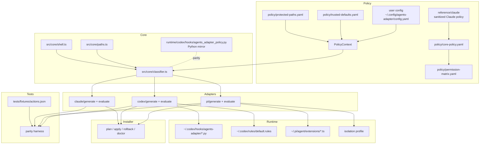
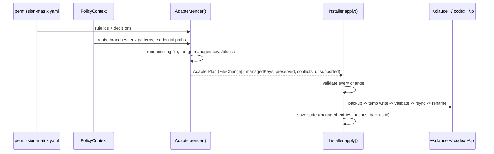
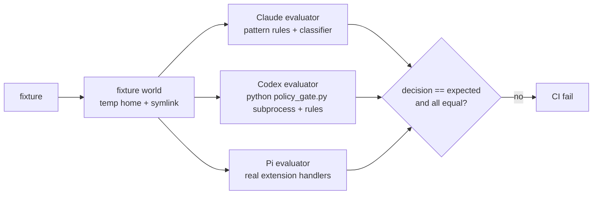
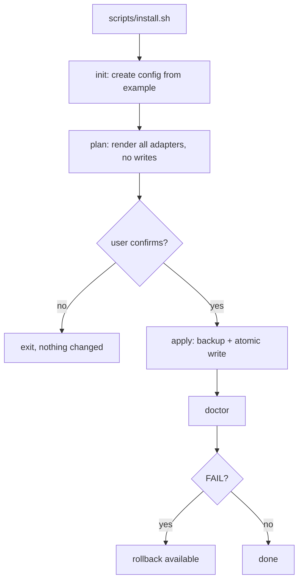

# Architecture

## ภาพรวม

agents-adapter แยกเป็น 6 ชั้นที่ไม่ปนกัน: policy, adapter, runtime enforcement, installer, tests และ documentation

## Policy layer

| ไฟล์ | บทบาท |
|---|---|
| `reference/claude/*` | behavioral authority ที่ sanitize แล้ว |
| `policy/core-policy.yaml` | กฎ provider-neutral: language, trust zone, approval, git/github workflow, CI gates, destructive, staging/production boundary, retry, completion |
| `policy/permission-matrix.yaml` | rule id + decision + category; contract ที่ adapter และ test ใช้ร่วมกัน |
| `policy/protected-paths.yaml` | credential path, basename, extension, system config path, credential env var |
| `policy/trusted-defaults.yaml` | temp/cache ที่เขียนได้, agent config dir, excluded commands, public registries |
| `policy/provenance.yaml` | rule -> section/JSON path ของ Claude reference |
| `policy/schema/*.json` | JSON schema ที่ loader บังคับใช้ |

## Core classifier

`classifyCommand(command, ctx)` ทำงานเป็นขั้น:

1. parse shell เป็น simple command (quoting, `;`/`&&`/`||`/`|`, redirection, `$(...)`, backtick, `sh -c`/`bash -lc`, wrapper `env`/`command`/`exec`/`nice`/`time`/`nohup`, `VAR=value` prefix)
2. ตรวจ bypass flag ทุก segment (DENY ก่อนอย่างอื่น)
3. per-command classification (git, gh, docker, package manager, rm, database, deploy, remote, artisan, build/test/lint, read-only)
4. path ใน argument และ redirection ผ่าน `classifyPath` (credential > prod env > trust zone > dev env > outside)
5. substitution ทำให้ ALLOW กลายเป็น ASK
6. รวมด้วย `strictest()` (DENY > ASK > ALLOW; tie เลือก verdict แรก = ของคำสั่ง)

`classifyTool(call, ctx)` ครอบ file tool, shell tool, `apply_patch` และ GitHub connector tool (`github.*`, `mcp__github__*`)

Python mirror มีโครงสร้างฟังก์ชันเดียวกันทีละตัว parity test รัน fixture เดียวกันผ่านทั้งสอง

## Normalized matrix ถึง adapter

## Runtime enforcement

| CLI | ALLOW | ASK | DENY |
|---|---|---|---|
| Claude | native allow + autoMode | `permissions.ask` + autoMode soft_deny | `permissions.deny` + sandbox deny paths + `disableBypassPermissionsMode` |
| Codex | permission profile | rules `prompt` + approvals reviewer policy + hook additionalContext | PreToolUse hook exit 2 + rules `forbidden` + filesystem deny + requirements |
| Pi | extension pass-through | extension `ctx.ui.confirm()` + session cache | extension block + `user_bash` result replacement + `/share` handled; isolation สำหรับ credential |

## Parity tests

## Installation flow

