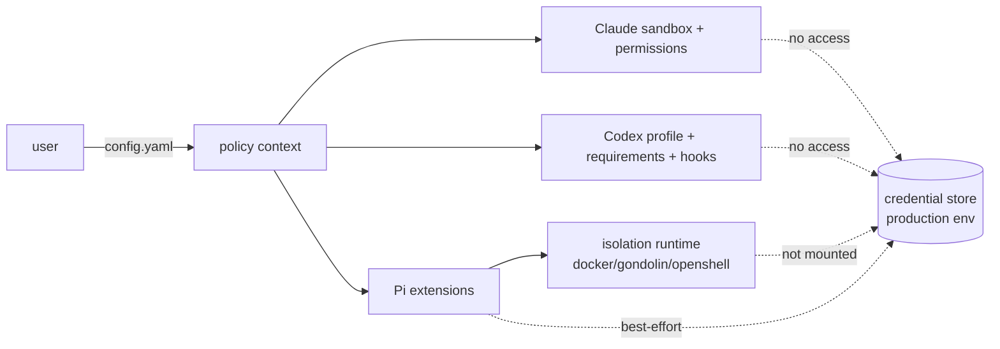

# Security Model

## เป้าหมาย

ทำให้ hard boundary ของ agent เป็นสิ่งที่ตรวจสอบได้ในทุก CLI: credential, production env, protected branch, force push, merge, gist, bypass flag

## Trust boundaries

- user config และ policy files เป็น trusted input แต่ผ่าน schema + semantic validation (ห้าม root เป็น `/` หรือ home, ห้าม metacharacter ใน branch/owner, env pattern เป็น basename เท่านั้น)
- ค่าจาก config ถูก sanitize ก่อนใส่ template (marker injection)
- runtime config ของ hook/extension เป็น JSON ที่ serialize จาก PolicyContext ไม่มี code จาก user

## Defense in depth

| ชั้น | Claude | Codex | Pi |
|---|---|---|---|
| prompt policy | CLAUDE.md block | AGENTS.md block | AGENTS.md block |
| native permission | deny/ask/allow + autoMode | permission profile + rules + requirements | - |
| runtime gate | - | PreToolUse hooks (2 ตัว) | extensions (4 ตัว) |
| OS isolation | sandbox (filesystem, network, credentials) | seatbelt/landlock ตาม profile | container/VM profile |

DENY ต้องมีอย่างน้อยสองชั้นในทุก CLI ยกเว้น Pi host mode ที่มีชั้นเดียว (จึง best-effort + fallback)

## Adversarial cases ที่ทดสอบ

- command spacing, quoting, chaining (`;`, `&&`, `||`, `|`), comment
- `sh -c`, `bash -lc`, `zsh -lc`, nested shell, `env VAR=value`, `VAR=value cmd`, `command`, `nohup`, `nice`
- substitution `$(...)`, backtick, `$VAR`, subshell `(...)`
- path traversal `../`, `$HOME`, `${HOME}`, `~`, symlink escape (รวม target ที่ยังไม่มี)
- refspec: `HEAD`, `HEAD:main`, `HEAD~1:x`, `refs/heads/main`, `feature:main`, `:main`, `--delete main`, `+ref`, `--force-with-lease=ref`, `-uf`, `--mirror`, `--all`, `-C dir`
- nested `.env.production`, `.env.prod.*`, quoted path, uppercase command
- `gh api` merge/gist/secrets/repo delete, connector tool names (`github.*`, `mcp__github__*`), `apply_patch` headers
- Docker compose destructive variants (`-v`, `--volumes`, combined flags, legacy `docker-compose`)
- Pi `!` และ `!!`, `/share`
- bypass flags ทุกรูปแบบ (uppercase, `=`, nested shell)

## Known limitations

ดู `SECURITY.md` และ `docs/parity-matrix.md` (Unsupported cases)

## Reporting

ดู `SECURITY.md` (responsible disclosure)
